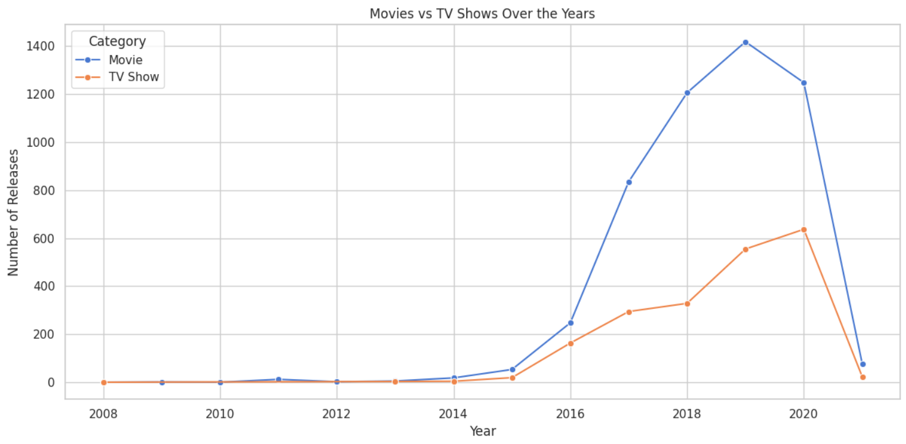
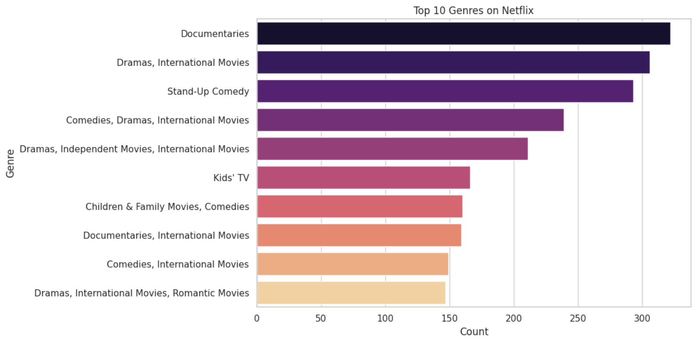
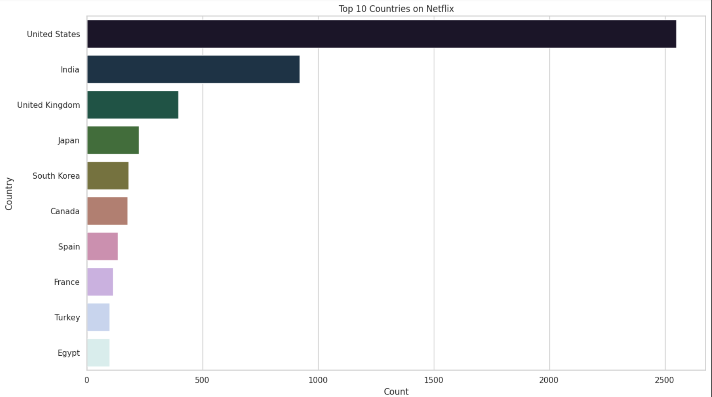
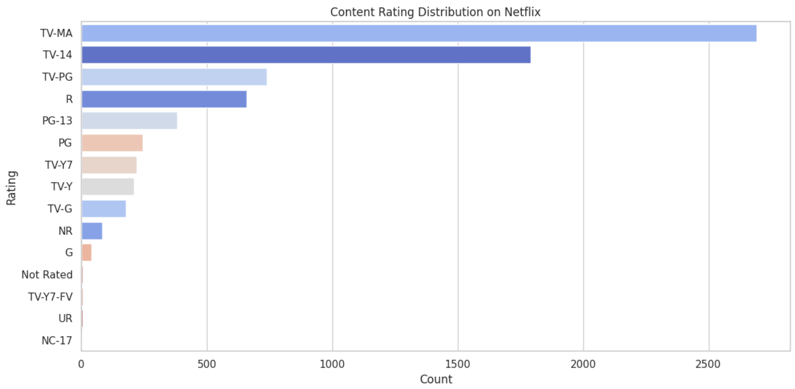

# 🎬 Netflix Data Analysis: A Data-Driven Exploration of Global Content 📊🌍

Netflix has become one of the most prominent global streaming platforms, continuously expanding its library with a mix of original productions and licensed content. However, with growing competition from platforms like Amazon Prime, Disney+, and regional OTT providers, Netflix must strategically analyze its content catalog to identify strengths, gaps, and opportunities.

The focus of this project is **Content Trends Analysis for Strategic Recommendations**, aiming to uncover how Netflix’s content distribution (Movies vs. TV Shows, genres, and country contributions) has evolved over the years. This analysis provides insights into audience preferences, key genres, and global content strategy.

---

## 📑 Table of Contents

1. [Problem Statement](#-problem-statement)

2. [Importance of the Problem](#-importance-of-the-problem)

3. [Objectives](#-objectives)

4. [Dataset: A Closer Look](#-dataset-a-closer-look)

5. [Data Cleaning & Preprocessing](#-data-cleaning--preprocessing)

6. [Key Findings & Visualizations](#-key-findings--visualizations)

   * [Movies vs. TV Shows Over Time](#-movies-vs-tv-shows-over-time)
   * [Top Genres on Netflix](#-top-genres-on-netflix)
   * [Country-Wise Content Distribution](#-country-wise-content-distribution)
   * [Content Rating Patterns](#-content-rating-patterns)

7. [Sample Visualizations](#-sample-visualizations)

   * [Visualization Movies vs. TV Shows Over the Years](#-visualization-movies-vs-tv-shows-over-the-years)
   * [Visualization Top 10 Genres](#-visualization-top-10-genres)
   * [Visualization Top 10 Countries Producing Content](#-visualization-top-10-countries-producing-content)
   * [Visualization Content Rating Distribution](#%EF%B8%8F-visualization-content-rating-distribution)

8. [How to Run this Notebook](#-how-to-run-this-notebook)

9. [Summary & Expected Outcomes](#-summary--expected-outcomes)

---

## 📝 Problem Statement

Netflix’s content catalog has expanded globally with a mix of original and licensed content. With intense competition from Amazon Prime, Disney+, and regional OTT platforms, Netflix needs to strategically evaluate its content library.

The problem addressed in this project is:

**“Content Trends Analysis for Strategic Recommendations.”**

The goal is to analyze Netflix’s content distribution over the years (Movies vs. TV Shows, genres, and country contributions) to identify strengths, gaps, and opportunities for strategic decision-making.

---

## 📌 Importance of the Problem

Understanding Netflix’s content trends is crucial for data-driven business decisions. Key reasons include:

* Highlighting the balance between Movies and TV Shows
* Identifying popular genres and underrepresented categories
* Gaining insights into country-wise content contributions for global market penetration

This knowledge enables Netflix to refine its strategy for content acquisition and production, ensuring it targets the right audience segments while remaining competitive in the global OTT industry.

---

## 🎯 Objectives

* Analyze the distribution of **Movies vs. TV Shows** over the years
* Identify the most common **genres** and track their popularity changes
* Compare **country-wise contributions** to Netflix’s catalog
* Provide **strategic recommendations** based on content trends

---

## 📦 Dataset: A Closer Look

The dataset used is `Netflix Dataset.csv`, containing rich details about Movies and TV Shows available on Netflix.

### Content Attributes

* **show_id** → Unique identifier for each title
* **title** → Title of the movie/show
* **category** → Movie or TV Show
* **director**, **cast** → Associated talent
* **country** → Country of production
* **release_date** → Original release year/date
* **duration** → Runtime (minutes) or Seasons
* **genre** → Type of content (Drama, Comedy, etc.)
* **rating** → Audience suitability (PG, TV-MA, etc.)

---

## 🧹 Data Cleaning & Preprocessing

* **Handling Missing Values** → Checked and summarized missing data

* **Feature Engineering** →

  * Extracted `Year` from `release_date`
  * Split `duration` into `Duration_Val` and `Duration_Unit`

* **Filtering Data** → Separated:

  * Movies only
  * TV Shows only
  * Recent releases (post-2015)
  * Drama-focused subset

---

## 📈 Key Findings & Visualizations

### 🎬 Movies vs. TV Shows Over Time

* **Finding:** Netflix has shifted focus in recent years, with a growing share of **TV Shows**.
* **Visualization:** Line chart comparing yearly trends.
* **🔮 Strategic Recommendation:** Invest more in original TV series production in high-growth regions to retain subscribers and compete with other streaming platforms.

---

### 🎭 Top Genres on Netflix

* **Finding:** Genres like **Drama** and **Comedy** dominate the platform.
* **Visualization:** Bar chart of top 10 genres.
* **🔮 Strategic Recommendation:** Expand niche genres (e.g., Sci-Fi, Documentaries) to attract underserved audiences and increase content diversity.

---

### 🌎 Country-Wise Content Distribution

* **Finding:** USA leads in Netflix content, followed by India and the UK.
* **Visualization:** Horizontal bar chart of top 10 countries.
* **🔮 Strategic Recommendation:** Produce region-specific content in emerging markets (like India, Brazil, Southeast Asia) to increase global reach and engagement.

---

### 🔞 Content Rating Patterns

* **Finding:** Most shows/movies are rated for **mature audiences (TV-MA, R)**.
* **Visualization:** Count plot of content ratings.
* **🔮 Strategic Recommendation:** Diversify content rating offerings (family-friendly, teen-focused) to broaden target demographics and enhance subscriber retention.

---

## 📊 Sample Visualizations

### 📈 Visualization Movies vs. TV Shows Over the Years



### 🎨 Visualization Top 10 Genres



### 🌍 Visualization Top 10 Countries Producing Content



### 🛡️ Visualization Content Rating Distribution



---

## 🚀 How to Run this Notebook

### Option 1: Google Colab (Recommended)

1. Upload both:

   * `Vedant_Bende_Major_Project_(Netflix_Data_Analysis).ipynb`
   * `Netflix Dataset.csv` to Google Drive

2. Mount Google Drive inside Colab:

```python
from google.colab import drive
drive.mount('/content/drive')
```

3. Update dataset path:

```python
df = pd.read_csv("/content/drive/MyDrive/Netflix Dataset.csv")
```

---

### Option 2: Run Locally

```bash
pip install pandas numpy matplotlib seaborn tabulate
jupyter notebook Vedant_Bende_Major_Project_(Netflix_Data_Analysis).ipynb
```

---

## 📌 Summary & Expected Outcomes

* Clear understanding of how Netflix’s content strategy has evolved
* Identification of top-performing genres and categories
* Insights into global content contribution by country
* Strategic recommendations for future content investment and diversification

---

✨ Developed with **Python, Google Colab, and Data Visualization Tools** ✨

---
